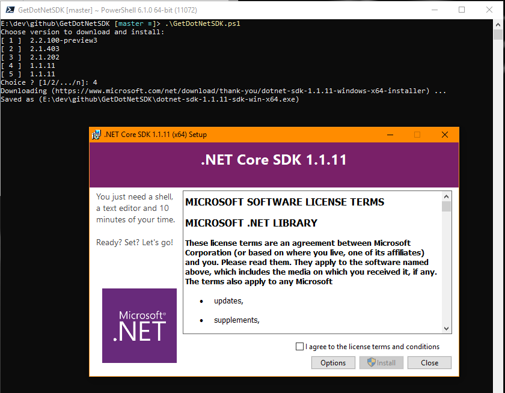

# GetDotNetSDK
Powershell script to quickly get a dotnet sdk installer.  

** This script works in Powershell Core only **

# How it works
From powershell just run the script.  
It will find the x64 SDK links on Microsoft's DotNet download page and pull out the available versions.  
A list is presented of the available SDK versions.  
After choosing which version the file will download to the current folder and then launch the installer.  

# Tricky Part
This isn't straight forward with downloading from a direct link.  When you select the download link the page redirects to a download page so using DownloadFile doesn't work.  So a further check on the redirected page for the retry link is located and used to download the file directly.  
  
  
